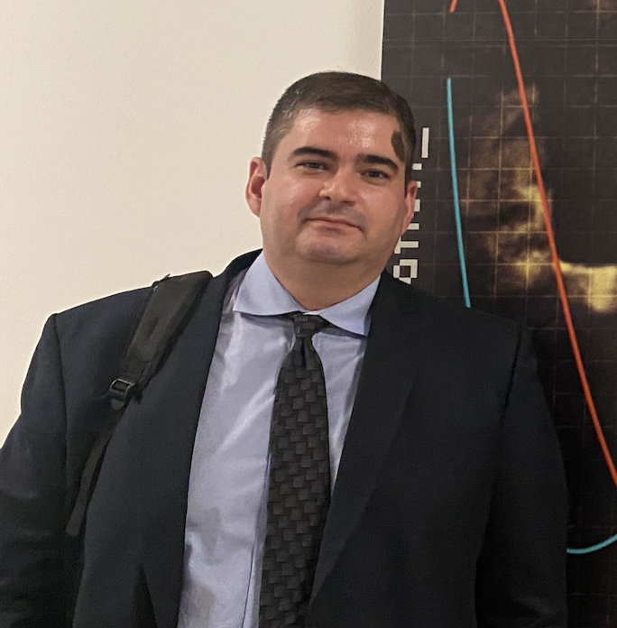

I am an Associate Professor at IMECC/Unicamp, the Institute of Mathematics, Statistics and Scientific Computing at the University of Campinas.

My research area is the qualitative theory of dynamical systems: Filippov systems, structural stability, systems with symmetries (Hamiltonian and/or reversible-equivariant), existence and stability of limit cycles, Ricci flow on homogeneous manifolds, etc.

I am currently the Director of the Institute of Mathematics, Statistics, and Scientific Computing at Unicamp (2022–2026), a columnist for the Noticiário da Sociedade Brasileira de Matemática, and Coordinator of the Undergraduate Teaching Committee of the Brazilian Mathematical Society.

My e-mail is: RMiranda [at] unicamp [dot] br

## Research & Publications

- [List of publications](#)
- [Currículo Lattes](http://lattes.cnpq.br/7260833760482439)
- [CV (pdf)](#)
- Rede TeQA (Teoria Qualitativa e Aplicações) de Sistemas Dinâmicos (Dynamical Systems Network in Brazil)

## Teaching/Disciplinas, etc

- Disciplinas de semestres anteriores e outras coisas sobre ensino
- 2025-2: MM996 – Seminários de Sistemas Dinâmicos I
- 2025-2: MA211 – Cálculo II – turmas G e H
- 2025-1: MA311 – Cálculo III
- Youtube: MA141 – Geometria Analítica e Vetores
- Youtube: MCA003 – Cálculo III na Univesp: aula de revisão
- Tutoria em Matemática
- ReME – Repositório de Metodologias para o Ensino

## Textos

- Blog, com alguns textos sobre matemática, ensino, ciência, etc
- Conselhos sobre cartas de recomendação
- Dicas sobre como estudar matemática
- Dicas sobre como procurar uma iniciação científica
- Tutoriais sobre nova política de divulgação de notas
- Tutorial do AutoMultipleChoice para fazer provas de múltipla escolha com correção automática (banco de questões)
- Tutorial para fazer provas no Moodle (provas aleatórias, com base em um banco de questões)
- Fotos “acadêmicas”

## Etc

- I share Federico Ardila’s axioms, in particular the Axiom 4: “Every student deserves to be treated with dignity and respect”. See more details here.
- What does Yoda have to tell us today? "Difficult to see. Always in motion is the future."

## Contact

IMECC/Unicamp – main building (office #335)  
R. Sérgio Buarque de Holanda, 651  
Cidade Universitária  
Campinas/SP  
Brazil  
13083-859  
